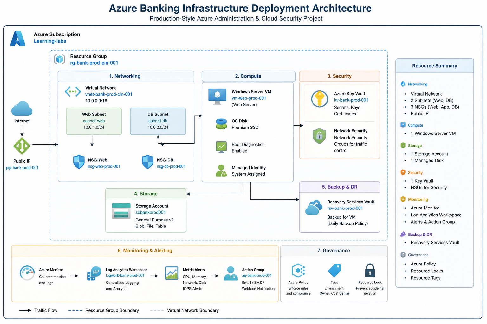

# Azure Solution Architecture

This folder contains the high-level architecture of the Azure Banking Infrastructure Deployment project.

---

## Architecture Diagram

The diagram below represents the complete production-style Azure environment deployed during this project.

---

## Architecture Overview

The solution demonstrates a secure Azure environment built using Microsoft Azure best practices.

### Networking

- Azure Virtual Network
- Web Subnet
- Database Subnet
- Public IP
- Network Security Groups

### Compute

- Windows Server Virtual Machine
- Managed Disk
- Boot Diagnostics
- Managed Identity

### Security

- Azure Key Vault
- Azure Policy
- Network Security Groups

### Storage

- Azure Storage Account

### Monitoring

- Azure Monitor
- Log Analytics Workspace
- Metric Alerts
- Action Group

### Backup

- Recovery Services Vault
- Daily Backup Policy

### Governance

- Resource Tags
- Resource Locks
- Azure Policy Assignment

---

## Project Flow

Internet

↓

Public IP

↓

Virtual Network

↓

Windows Server VM

↓

Azure Monitor

↓

Recovery Services Vault

↓

Azure Key Vault

↓

Azure Policy & Governance

---

## Purpose

This architecture demonstrates how enterprise Azure environments are designed to meet security, governance, monitoring, backup, and operational best practices.
