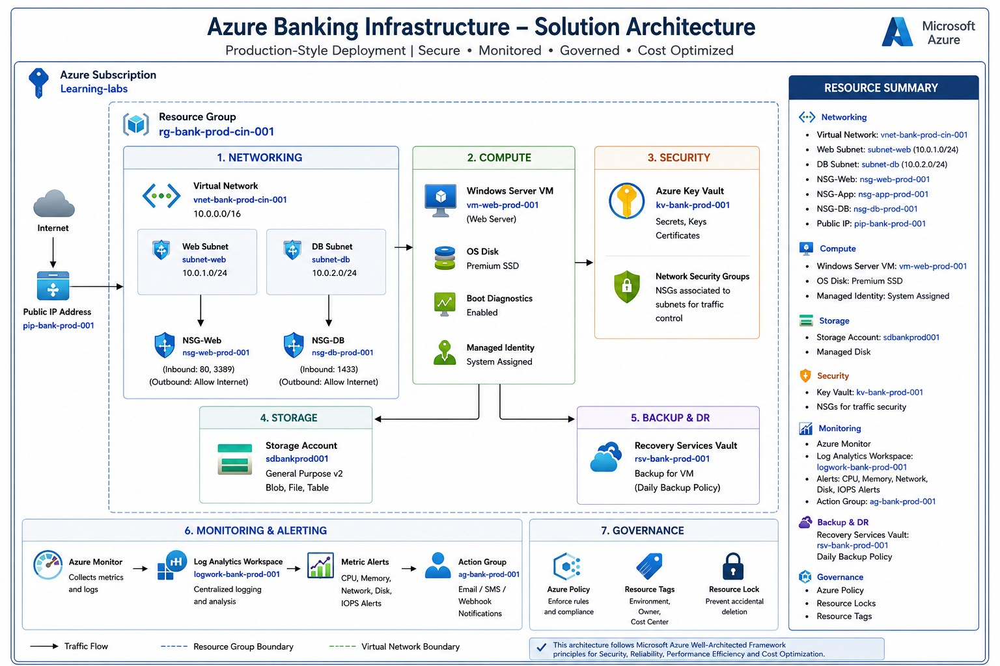

# 🏛 Azure Solution Architecture

Production-Style Azure Banking Infrastructure Deployment

---

## 📖 Overview

This folder contains the high-level architecture diagram for the Azure Banking Infrastructure Deployment project.

The solution was designed using Microsoft Azure best practices and demonstrates how enterprise workloads are deployed securely with networking, monitoring, governance, backup, and security services.

---

# 🖼 Architecture Diagram

> **Enterprise Azure Banking Infrastructure**

---

# 🏗 Solution Components

## Azure Subscription

- Learning-labs

---

## Resource Group

- rg-bank-prod-cin-001

---

## Networking

- Virtual Network
  - vnet-bank-prod-cin-001

- Address Space
  - 10.0.0.0/16

- Web Subnet
  - subnet-web
  - 10.0.1.0/24

- Database Subnet
  - subnet-db
  - 10.0.2.0/24

- Public IP Address

- Network Security Groups
  - nsg-web-prod-001
  - nsg-app-prod-001
  - nsg-db-prod-001

---

## Compute

- Windows Server Virtual Machine
  - vm-web-prod-001

- Managed OS Disk

- Boot Diagnostics

- Managed Identity

---

## Storage

- Storage Account

- Blob Storage

- File Shares

- Tables

---

## Security

- Azure Key Vault
  - kv-bank-prod-001

- Azure Policy

- Network Security Groups

- Resource Locks

- Resource Tags

---

## Monitoring

- Azure Monitor

- Log Analytics Workspace
  - logwork-bank-prod-001

- Metric Alerts

- Action Group

---

## Backup & Disaster Recovery

- Recovery Services Vault
  - rsv-bank-prod-001

- Daily VM Backup Policy

---

# 🔄 Traffic Flow

Internet

↓

Public IP Address

↓

Virtual Network

↓

Web Subnet

↓

Windows Server VM

↓

Azure Key Vault

↓

Azure Monitor

↓

Recovery Services Vault

↓

Azure Policy & Governance

---

# 🛡 Security Controls Implemented

- Azure RBAC
- Managed Identity
- Azure Key Vault
- Network Security Groups
- Azure Policy
- Resource Locks
- Resource Tags
- Azure Monitor
- Log Analytics
- Azure Backup

---

# 📊 Services Used

| Category | Azure Services |
|-----------|----------------|
| Identity | Azure RBAC, Managed Identity |
| Networking | VNet, Subnets, NSGs, Public IP |
| Compute | Azure Virtual Machine |
| Storage | Storage Account |
| Security | Azure Key Vault, Azure Policy |
| Monitoring | Azure Monitor, Log Analytics |
| Backup | Recovery Services Vault |
| Governance | Resource Locks, Tags |

---

# 🎯 Project Objective

This architecture demonstrates how a production-style Azure infrastructure can be deployed using Microsoft Azure services following enterprise security, governance, monitoring, backup, and operational best practices.

The implementation aligns with Azure Well-Architected Framework principles for:

- Security
- Reliability
- Operational Excellence
- Performance Efficiency
- Cost Optimization

---

**Project Status:** ✅ Completed
